# Liverpool FC Analytics Platform

A full-stack football analytics platform covering Liverpool FC's entire Premier League history from 2000/01 to the present. Built with a production-grade data engineering stack: multi-source scraping, BigQuery as the data warehouse, dbt for transformations, and a React dashboard deployed on a GCP VM.

**Live at:** [liverpool-analytics.hadighazi.com](https://liverpool-analytics.hadighazi.com)

---

## Architecture

### Visual overview

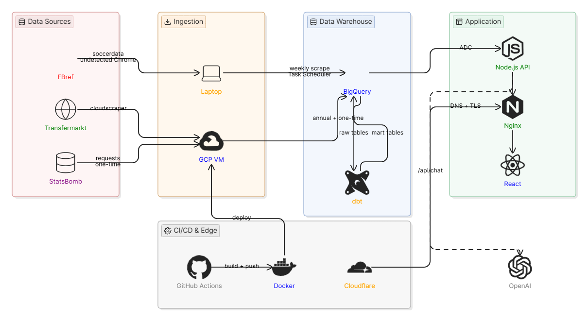

### Detailed layer breakdown

```
┌─────────────────────────────────────────────────────────────────────────┐
│                         DATA SOURCES                                    │
│                                                                         │
│   FBref (via soccerdata)          Transfermarkt (via cloudscraper)      │
│   - Player stats (Big5 pages)     - Squad market values                 │
│   - Match results & scores        - Transfer history & fees             │
│   - 26 seasons (2000-present)     - 26 seasons (2000-present)           │
│                                                                         │
└───────────────┬──────────────────────────┬──────────────────────────────┘
                │                          │
                │ Residential IP required  │ Datacenter IP OK
                │ (Cloudflare blocks GCP)  │ (cloudscraper bypasses)
                │                          │
┌───────────────▼──────────────────────────▼──────────────────────────────┐
│                    INGESTION LAYER                                       │
│                                                                         │
│  Local Laptop (Windows)              GCP VM (europe-west1-b)            │
│  ┌─────────────────────────────┐     ┌──────────────────────────────┐   │
│  │  scraper/scrape_liverpool.py│     │  transfermarkt/scrape_tm.py  │   │
│  │  - soccerdata library       │     │  - cloudscraper              │   │
│  │  - undetected-chromedriver  │     │  - BeautifulSoup             │   │
│  │  - Big5 player stat pages   │     │  - Run manually each season  │   │
│  │  - Squad match logs         │     │                              │   │
│  │  Windows Task Scheduler:    │     │                              │   │
│  │  Every Monday 09:00         │     │                              │   │
│  └──────────────┬──────────────┘     └──────────────┬───────────────┘   │
│                 │                                   │                   │
└─────────────────┼───────────────────────────────────┼───────────────────┘
                  │                                   │
                  │         Both write to             │
                  └──────────────┬────────────────────┘
                                 │
┌────────────────────────────────▼────────────────────────────────────────┐
│                    DATA WAREHOUSE — BigQuery (EU)                        │
│                    Project: liverpool-analytics                          │
│                    Dataset: liverpool_analytics                          │
│                                                                         │
│  RAW TABLES (scraped data)                                              │
│  ┌──────────────────┐  ┌─────────────────────┐  ┌──────────────────┐  │
│  │  raw_matches     │  │  raw_player_stats   │  │  scraped_seasons │  │
│  │  ~950 rows       │  │  ~700 rows          │  │  season metadata │  │
│  │  26 seasons      │  │  26 seasons         │  │  completion flag │  │
│  └──────────────────┘  └─────────────────────┘  └──────────────────┘  │
│                                                                         │
│  ┌──────────────────┐  ┌─────────────────────┐  ┌──────────────────┐  │
│  │  tm_squad_values │  │  tm_transfers       │  │tm_player_value_ │  │
│  │  market values   │  │  fees, clubs        │  │history (SCD2 TM) │  │
│  │  21+ seasons     │  │  all directions     │  │  valid_from/to   │  │
│  └──────────────────┘  └─────────────────────┘  └──────────────────┘  │
│                                                                         │
│  GRAPH TABLES (BigQuery Property Graph)                                 │
│  ┌──────────────────┐  ┌─────────────────────┐  ┌──────────────────┐  │
│  │  graph_players   │  │  graph_seasons      │  │  graph_clubs     │  │
│  │  (nodes)         │  │  (nodes)            │  │  (nodes)         │  │
│  └──────────────────┘  └─────────────────────┘  └──────────────────┘  │
│  ┌──────────────────┐  ┌─────────────────────┐  ┌──────────────────┐  │
│  │  edge_played_in  │  │  edge_played_with   │  │  edge_transferred│  │
│  │  Player→Season   │  │  Player↔Player      │  │  Player→Club     │  │
│  └──────────────────┘  └─────────────────────┘  └──────────────────┘  │
│                                                                         │
│  PROPERTY GRAPH                                                         │
│  LiverpoolGraph — GQL queryable, ISO standard                          │
│                                                                         │
│  DATA QUALITY                                                           │
│  ┌──────────────────────────────────────────────────────────────────┐  │
│  │  pipeline_runs table  →  run metadata, row counts, status        │  │
│  │  Great Expectations   →  validation suites against raw tables    │  │
│  └──────────────────────────────────────────────────────────────────┘  │
│                                                                         │
└────────────────────────────┬────────────────────────────────────────────┘
                             │
┌────────────────────────────▼────────────────────────────────────────────┐
│                    TRANSFORMATION LAYER — dbt                            │
│                                                                         │
│  STAGING (views)                  MARTS (tables)                        │
│  ┌──────────────────┐             ┌──────────────────────────────────┐  │
│  │  stg_matches     │──────────►  │  liverpool_match_results         │  │
│  │  stg_player_stats│──────────►  │  liverpool_season_summary        │  │
│  └──────────────────┘             │  liverpool_player_performance     │  │
│                                   │  liverpool_squad_value            │  │
│  dbt tests                        │  liverpool_transfer_balance       │  │
│  ┌──────────────────┐             │  liverpool_player_values         │  │
│  │  not_null        │             └──────────────────────────────────┘  │
│  │  unique          │                                                   │
│  │  accepted_range  │                                                   │
│  │  relationships   │                                                   │
│  └──────────────────┘                                                   │
│                                                                         │
└────────────────────────────┬────────────────────────────────────────────┘
                             │
┌────────────────────────────▼────────────────────────────────────────────┐
│                    SERVING LAYER — Node.js / Express                    │
│                    Deployed on GCP VM via Docker                        │
│                                                                         │
│  /api/matches          →  Match results, cumulative points              │
│  /api/matches/summary  →  Season W/D/L/GF/GA/pts summary               │
│  /api/players          →  Player performance stats (sortable)           │
│  /api/seasons          →  Available seasons from scraped_seasons        │
│  /api/transfers/*      →  Squad values, balances, history, player vals  │
│  /api/player-profile/* →  Combined TM + FBref player profile            │
│  /api/graph/*          →  Partnership networks, squad graphs            │
│  /api/chat             →  GPT-4o-mini with BigQuery context             │
│                                                                         │
└────────────────────────────┬────────────────────────────────────────────┘
                             │
┌────────────────────────────▼────────────────────────────────────────────┐
│                    PRESENTATION LAYER — React + Vite                    │
│                    Deployed on GCP VM via Nginx + Docker                │
│                                                                         │
│  Season page    →  Points progression, result donut, form strip        │
│  Attack page    →  Top scorers, shooting efficiency, home/away goals   │
│  Defense page   →  Tackles, interceptions, clean sheets, discipline    │
│  Squad page     →  Sortable table + card view + player profile modal   │
│  Transfers page →  Squad value evolution, transfer spend, player vals  │
│  Network page   →  D3 force-directed graph, squad connections          │
│                                                                         │
│  Season selector  →  Dynamic, populated from /api/seasons              │
│  AI Chatbot       →  GPT-4o-mini answering questions about the data    │
│  Player Modal     →  Photo, bio, career stats, MV history, transfers  │
│                                                                         │
└─────────────────────────────────────────────────────────────────────────┘

┌─────────────────────────────────────────────────────────────────────────┐
│                    INFRASTRUCTURE                                        │
│                                                                         │
│  GCP Compute Engine VM (europe-west1-b)                                 │
│  ├── e2-standard-2, Ubuntu 24.04, 50GB disk                            │
│  ├── Docker Compose: backend, frontend, nginx                           │
│  ├── Nginx: TLS termination, rate limiting, HSTS                       │
│  ├── Let's Encrypt: TLS certificate                                     │
│  └── Cloudflare DNS: liverpool-analytics.hadighazi.com                  │
│                                                                         │
│  GCP Artifact Registry (europe-west1)                                   │
│  └── Docker images: backend, frontend, scraper, dbt, transfermarkt     │
│                                                                         │
│  GitHub Actions CI/CD                                                   │
│  ├── OIDC Workload Identity (no JSON key stored)                        │
│  ├── Build + push all Docker images on push to main                    │
│  └── SSH deploy to VM: git pull + docker compose pull + up             │
│                                                                         │
│  Scheduling                                                             │
│  ├── FBref scraper: Windows Task Scheduler (laptop, every Monday)      │
│  └── TM scraper: manual (run once per season, August)                    │
│                                                                         │
└─────────────────────────────────────────────────────────────────────────┘
```

---

## Tech Stack

| Layer | Technology |
|---|---|
| **Frontend** | React 18, Vite, CSS Modules, D3.js |
| **Backend API** | Node.js, Express, ES Modules |
| **Data Warehouse** | Google BigQuery (EU region) |
| **Transformations** | dbt 1.11 (BigQuery adapter) |
| **FBref Scraping** | Python, soccerdata, undetected-chromedriver, Playwright |
| **TM Scraping** | Python, cloudscraper, BeautifulSoup, lxml |
| **Data Validation** | Great Expectations (optional), dbt tests |
| **Graph Database** | BigQuery Property Graph (GQL / ISO standard) |
| **AI Chatbot** | OpenAI GPT-4o-mini |
| **Containerisation** | Docker, Docker Compose |
| **CI/CD** | GitHub Actions, OIDC Workload Identity Federation |
| **Infrastructure** | GCP Compute Engine, Artifact Registry |
| **DNS / TLS** | Cloudflare, Let's Encrypt (certbot) |
| **Web Server** | Nginx (reverse proxy, TLS, rate limiting, HSTS) |
| **Scheduling** | Windows Task Scheduler (FBref weekly scrape) |
| **Logging** | Winston (console + file, environment-aware) |

---

## Dashboard Screenshots

### Season overview

Points progression with result-coloured dots, W/D/L donut, form strip, key stats and AI analyst chatbot.

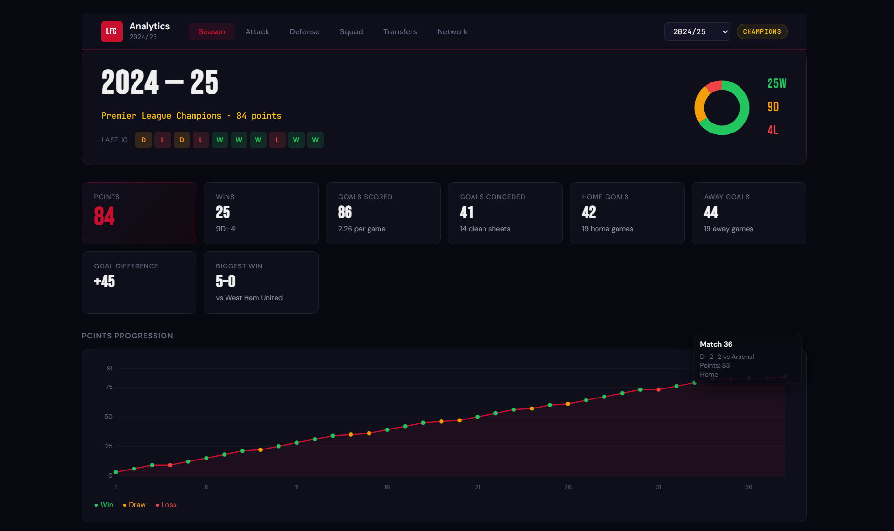

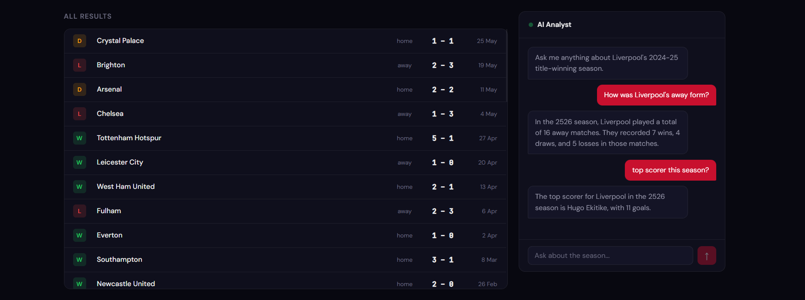

### Attack

Top scorers, shooting efficiency table, goals by venue, and offside counts as a proxy for attacking intent.

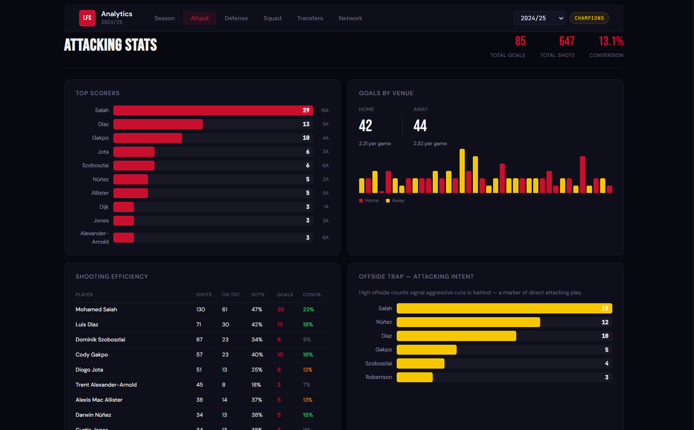

### Defense

Tackles and interceptions leaderboards, goals conceded timeline, disciplinary table.

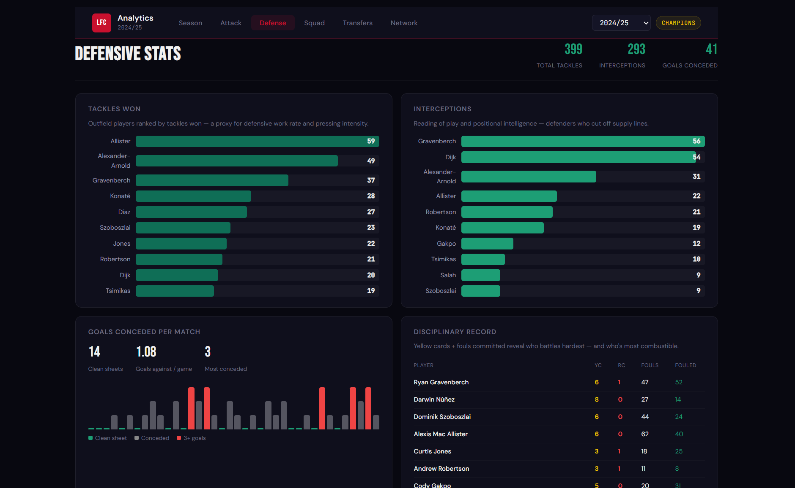

### Squad

Sortable stats table with card view toggle. Click any player to open the profile modal.

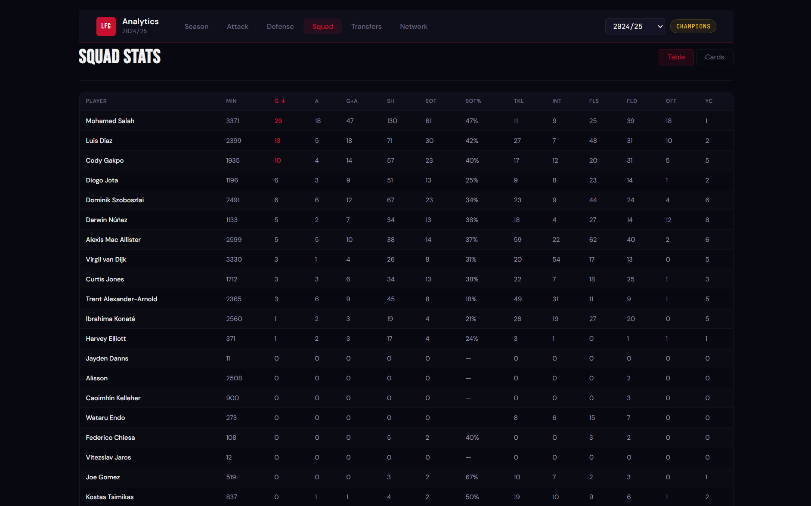

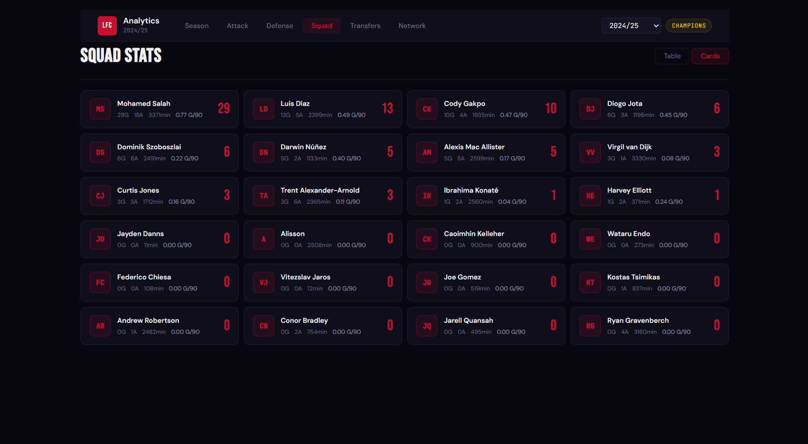

### Player profile modal

Photo from Transfermarkt CDN, bio, career summary, and tabs for current season stats, season-by-season history, and transfer history with fees.

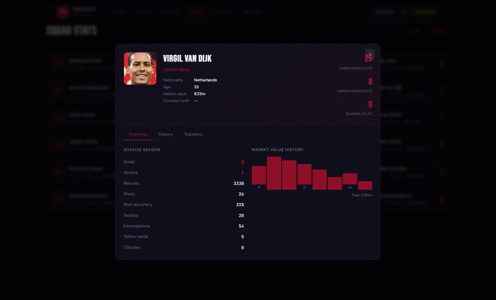

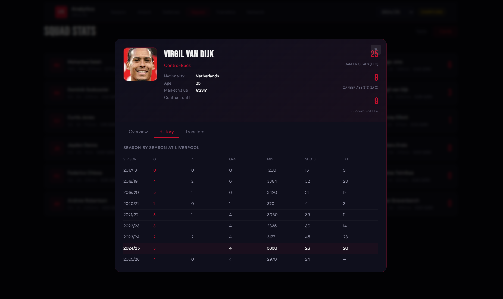

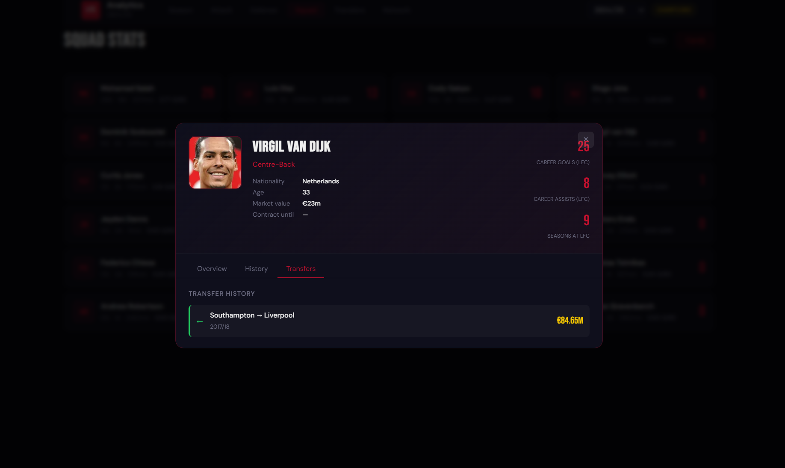

### Transfers

Squad value evolution (2004–present), transfer spend vs income chart, all-time biggest buys and sales, and a value vs performance table (G+A per €10m market value).

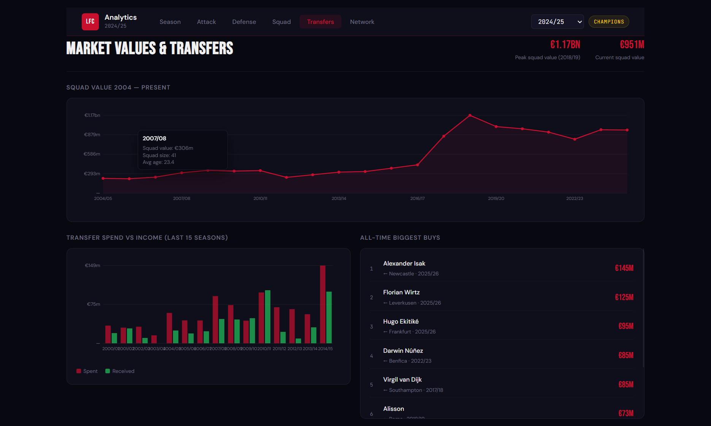

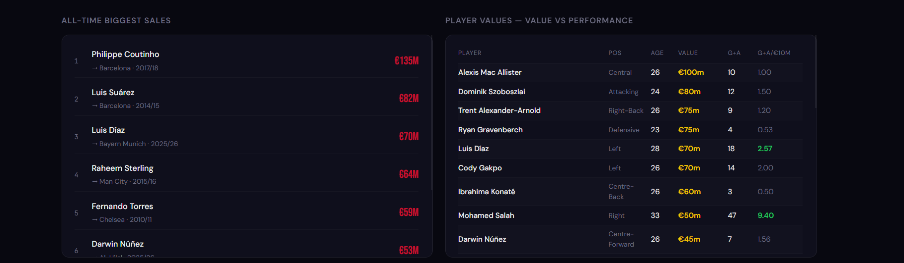

### Network graph

D3.js force-directed graph. Nodes are players (size = goals, colour = position), edges are PLAYED_WITH relationships (thickness = shared seasons). Filter by position, select season, click any node to explore partnerships.


---

## Repository Structure

```
liverpool-analytics/
│
├── readme-media/               # Screenshots and diagrams for this README
│   ├── diagram.png             # Eraser.io architecture diagram
│   ├── season.png
│   ├── season2.png
│   ├── attack.png
│   ├── defense.png
│   ├── squad.png
│   ├── squad2.png
│   ├── player.png
│   ├── player2.png
│   ├── player3.png
│   ├── transfers.png
│   ├── transfers2.png
│   └── network.gif
│
├── .github/
│   └── workflows/
│       ├── ci.yml              # Build and push Docker images on push to main
│       └── deploy.yml          # SSH deploy to GCP VM
│
├── scraper/                    # FBref scraper — runs on local laptop only
│   ├── scrape_liverpool.py     # Multi-season scraper, 2000/01 → present
│   ├── run_weekly.bat          # Windows Task Scheduler entry point
│   ├── requirements.txt
│   └── Dockerfile
│
├── transfermarkt/              # Transfermarkt scraper — runs on GCP VM manually
│   ├── scrape_tm.py            # Squad values + transfer history, 26 seasons
│   ├── requirements.txt
│   └── Dockerfile
│
├── dbt/                        # Data transformations
│   ├── dbt_project.yml
│   ├── profiles.yml            # Uses ADC (no key file needed)
│   └── models/
│       ├── staging/
│       │   ├── stg_matches.sql
│       │   ├── stg_player_stats.sql
│       │   └── schema.yml      # dbt tests: not_null, unique, accepted_range
│       └── marts/
│           ├── liverpool_match_results.sql
│           ├── liverpool_season_summary.sql
│           ├── liverpool_player_performance.sql
│           ├── liverpool_squad_value.sql
│           ├── liverpool_transfer_balance.sql
│           └── liverpool_player_values.sql
│
├── backend/
│   ├── src/
│   │   ├── index.js            # Express app entry point, route registration
│   │   ├── db/
│   │   │   └── bigquery.js     # ADC BigQuery client + query helper
│   │   └── routes/
│   │       ├── matches.js      # Match results + season summary
│   │       ├── players.js      # Player performance (sortable)
│   │       ├── seasons.js      # Available seasons
│   │       ├── transfers.js    # Squad values, balance, transfer history
│   │       ├── playerProfile.js# Combined TM + FBref player profile
│   │       ├── graph.js        # BigQuery Graph / GQL partnership queries
│   │       └── chat.js         # GPT-4o-mini AI analyst
│   ├── package.json
│   └── Dockerfile
│
├── frontend/
│   ├── src/
│   │   ├── main.jsx
│   │   ├── App.jsx             # Season state management, tab routing
│   │   ├── styles/
│   │   │   ├── globals.css     # CSS variables, Bebas Neue + DM Sans fonts
│   │   │   └── App.module.css
│   │   ├── hooks/
│   │   │   └── useData.js      # useMatches, usePlayers, useSeasons, useSummary
│   │   ├── components/
│   │   │   ├── Nav/            # Sticky nav with dynamic season selector
│   │   │   ├── StatCard/       # Reusable metric card
│   │   │   ├── FormStrip/      # W/D/L form dots (last 10 matches)
│   │   │   ├── AIChatbot/      # AI analyst chat widget with suggestions
│   │   │   └── PlayerModal/    # Player profile modal (photo, stats, MV, transfers)
│   │   └── pages/
│   │       ├── Dashboard.jsx   # Season overview: points chart, donut, match list
│   │       ├── Attack.jsx      # Top scorers, shooting efficiency, goals by venue
│   │       ├── Defense.jsx     # Tackles, interceptions, clean sheets, discipline
│   │       ├── Squad.jsx       # Sortable table + card view toggle
│   │       ├── Transfers.jsx   # Squad value evolution, transfer spend, player vals
│   │       └── Graph.jsx       # D3 force-directed network visualization
│   ├── index.html
│   ├── vite.config.js
│   ├── package.json
│   └── Dockerfile
│
├── nginx/
│   └── nginx.conf.template     # __DOMAIN__ substituted at container startup
│
├── docker-compose.yml          # backend, frontend, nginx
└── README.md
```

---

## BigQuery Schema

### Raw Tables

| Table | Description | Approx rows |
|---|---|---|
| `raw_matches` | PL match results by season | ~950 (26 seasons × 38) |
| `raw_player_stats` | FBref player stats by season | ~700 |
| `scraped_seasons` | Pipeline run metadata + completion flag | 26 |
| `tm_squad_values` | Player market values per season | ~800 |
| `tm_transfers` | Transfer history with fees and clubs | ~600 |
| `tm_player_value_history` | TM market value SCD2 (valid_from / valid_to) | ongoing |
| `pipeline_runs` | Scraper run log: status, rows, duration | ongoing |

### dbt Mart Tables

| Model | Materialisation | Description |
|---|---|---|
| `stg_matches` | View | Cleans scores, derives result/lfc_goals/opp_goals/venue_type |
| `stg_player_stats` | View | Casts string columns to FLOAT64 |
| `liverpool_match_results` | Table | Results with cumulative points + match number per season |
| `liverpool_season_summary` | Table | W/D/L/GF/GA/points/home_wins/away_wins per season |
| `liverpool_player_performance` | Table | Goals, assists, shots, tackles, interceptions per player/season |
| `liverpool_squad_value` | Table | Total squad value + highest value player per season |
| `liverpool_transfer_balance` | Table | Spend/received/net spend + biggest signing per season |
| `liverpool_player_values` | Table | Market value joined with performance, G+A per €10m |

### BigQuery Property Graph

```
LiverpoolGraph
│
├── Nodes
│   ├── Player   (player_id, name, nationality, position, photo_url)
│   ├── Season   (season_id, label, points, wins, goals_for)
│   └── Club     (club_id, name)
│
└── Edges
    ├── PLAYED_IN       Player → Season   (goals, assists, minutes)
    ├── PLAYED_WITH     Player ↔ Player   (shared_seasons, combined_goals)
    └── TRANSFERRED_TO  Player → Club     (fee_eur, direction, season)
```

Example GQL queries:

```sql
-- Who has Salah played with the most seasons?
GRAPH liverpool_analytics.LiverpoolGraph
MATCH (p:Player {name: 'Mohamed Salah'})-[e:PLAYED_WITH]-(partner:Player)
RETURN partner.name, e.shared_seasons, e.combined_goals
ORDER BY e.shared_seasons DESC

-- Full squad network for 2024/25
GRAPH liverpool_analytics.LiverpoolGraph
MATCH (p:Player)-[e:PLAYED_IN]->(s:Season {season_id: '2425'})
RETURN p.name, p.position, e.goals, e.assists
```

---

## Data Pipeline

### FBref Scraping (Local Laptop — Residential IP Required)

FBref uses Cloudflare Turnstile which actively blocks datacenter IPs including GCP, AWS, and DigitalOcean. The scraper must run from a residential IP.

**Why soccerdata:** It wraps undetected-chromedriver — a patched Chrome binary that removes all browser automation fingerprints, bypassing Cloudflare's JS challenge detection.

**What is scraped (Big5 league pages):**

| Page | Table ID | Stats available |
|---|---|---|
| Standard | `stats_standard` | Goals, assists, minutes, yellow/red cards |
| Shooting | `stats_shooting` | Shots, shots on target, SoT% |
| Misc | `stats_misc` | Fouls, fouled, offsides, interceptions, tackles won |
| Match logs | `matchlogs_for` | PL match dates, opponents, scores, venue |

> **Note:** Passing, defense, and possession stats return NaN for Premier League players on the free Big5 tier. FBref restricts these columns to premium subscribers for top 5 leagues.

```bash
# Scrape all seasons from 2000/01, skipping already-complete ones
python scraper/scrape_liverpool.py

# Scrape current season only (Task Scheduler runs this weekly)
python scraper/scrape_liverpool.py --current

# Scrape specific seasons
python scraper/scrape_liverpool.py 2425 2526

# Force rescrape (ignores is_complete flag)
python scraper/scrape_liverpool.py --force
```

**Windows Task Scheduler (`scraper/run_weekly.bat`):**

```batch
@echo off
cd C:\Users\User\liverpool-analytics\scraper
set GCP_PROJECT=liverpool-analytics
python scrape_liverpool.py --current
cd ..\dbt
set GCP_PROJECT=liverpool-analytics
dbt run --profiles-dir . --project-dir .
echo Done at %date% %time%
```

Scheduled: every Monday at 09:00, after FBref processes weekend matches.

### Transfermarkt Scraping (GCP VM — Manual, Annual)

Transfermarkt uses light Cloudflare protection. `cloudscraper` with Chrome browser emulation bypasses it. Datacenter IPs (GCP VM) work fine.

**What is scraped:**
- **Squad page:** player name, position, age, market value per season
- **Transfers page:** arrivals and departures with fees, clubs, player ages

```bash
# Scrape current season
python transfermarkt/scrape_tm.py 2526

# Scrape multiple specific seasons
python transfermarkt/scrape_tm.py 2425 2526

# Scrape last 10 seasons (default if no args)
python transfermarkt/scrape_tm.py
```

### dbt Transformations

```bash
cd dbt

# Windows PowerShell
$env:GCP_PROJECT = "liverpool-analytics"

# Linux / Mac
export GCP_PROJECT=liverpool-analytics

dbt run --profiles-dir . --project-dir .
dbt test --profiles-dir . --project-dir .
```

---

## Infrastructure Setup

### GCP Resources

| Resource | Details |
|---|---|
| VM name | `liverpool-analytics` |
| Zone | `europe-west1-b` |
| Machine type | e2-standard-2 (2 vCPU, 8GB RAM) |
| OS | Ubuntu 24.04 LTS, 50GB disk |
| Artifact Registry | `europe-west1-docker.pkg.dev/liverpool-analytics/liverpool` |
| BigQuery dataset | `liverpool_analytics`, location EU |
| VM service account | `368856641338-compute@developer.gserviceaccount.com` (ADC) |
| CI/CD service account | `github-actions-sa@liverpool-analytics.iam.gserviceaccount.com` |
| Workload Identity | OIDC pool, no JSON key stored anywhere |

### Docker Compose Services

| Service | Image | Purpose |
|---|---|---|
| `backend` | `REGISTRY/backend:latest` | Node.js API on port 3000 (internal) |
| `frontend` | `REGISTRY/frontend:latest` | React app served by nginx (internal) |
| `nginx` | `nginx:alpine` | Reverse proxy, TLS, rate limiting (ports 80/443 public) |

### CI/CD Flow

```
git push origin main
  ↓
GitHub Actions — build job
  → docker build: backend, frontend, scraper, dbt, transfermarkt
  → docker push all images to Artifact Registry with :SHA and :latest tags
  ↓
GitHub Actions — deploy job
  → SSH into VM as deploy user
  → git pull origin main
  → recreate .env from GitHub secrets
  → gcloud auth configure-docker europe-west1-docker.pkg.dev
  → docker compose pull backend frontend
  → docker compose up -d backend frontend nginx
  → docker image prune -f
```

---

## Local Development

### Prerequisites

- Python 3.11+ (Anaconda recommended on Windows)
- Node.js 20+
- Google Cloud SDK: `gcloud auth application-default login`
- `GCP_PROJECT=liverpool-analytics` environment variable

### FBref Scraper

```bash
cd scraper
pip install -r requirements.txt
playwright install chromium
python scrape_liverpool.py --current
```

### Transfermarkt Scraper

```bash
cd transfermarkt
pip install -r requirements.txt
python scrape_tm.py 2526
```

### dbt

```bash
cd dbt
pip install dbt-bigquery

$env:GCP_PROJECT = "liverpool-analytics"   # PowerShell
export GCP_PROJECT=liverpool-analytics     # bash

dbt run --profiles-dir . --project-dir .
dbt test --profiles-dir . --project-dir .
```

### Backend API

```bash
cd backend
npm install

GCP_PROJECT=liverpool-analytics \
OPENAI_API_KEY=sk-proj-... \
FRONTEND_URL=http://localhost:5173 \
CURRENT_SEASON=2526 \
node src/index.js
```

### Frontend

```bash
cd frontend
npm install
VITE_SEASON=2526 npm run dev
```

---

## Key Design Decisions

| Decision | Reasoning |
|---|---|
| FBref scraper on local laptop | FBref blocks GCP/datacenter IPs via Cloudflare Turnstile. Residential IP required |
| soccerdata over plain Playwright | soccerdata uses undetected-chromedriver which bypasses bot fingerprinting. Plain Playwright gets blocked |
| TM scraper on GCP VM | Transfermarkt allows datacenter IPs with cloudscraper. No residential IP needed |
| No Airflow | FBref blocks the VM so Airflow can't run the main scraper. TM runs rarely enough to be manual. Removed to reduce complexity |
| BigQuery over PostgreSQL | Serverless, no persistent storage management, SQL interface, supports Property Graph natively |
| ADC over service account keys | Org policy blocks key creation. ADC is also more secure — no credential files to leak |
| OIDC Workload Identity for CI/CD | No long-lived secrets stored in GitHub. Federated identity via Google |
| Big5 pages over squad subpages | FBref squad subpages redirect back to the main page (premium content). Big5 pages work on free tier |
| dbt views for staging | Zero storage cost, always fresh. Mart tables materialised for query performance |
| WRITE_APPEND + DELETE per season | Allows partial reruns. Season-level granularity for incremental loads |
| CSS Modules over Tailwind | Explicit scoped styles, no purge configuration, works without build-time compiler |
| Canvas for charts | Zero dependency charting. D3 only for the force-directed graph which genuinely needs it |

---

## Environment Variables

### VM `.env`

```env
GCP_PROJECT=liverpool-analytics
REGISTRY=europe-west1-docker.pkg.dev/liverpool-analytics/liverpool
OPENAI_API_KEY=sk-proj-...
DOMAIN=liverpool-analytics.hadighazi.com
FRONTEND_URL=https://liverpool-analytics.hadighazi.com
CURRENT_SEASON=2526
VITE_SEASON=2526
```

### GitHub Secrets

| Secret | Value |
|---|---|
| `GCP_PROJECT` | `liverpool-analytics` |
| `VM_HOST` | VM external IP address |
| `VM_SSH_KEY` | Private SSH key for the `deploy` user on the VM |
| `OPENAI_API_KEY` | OpenAI API key |
| `DOMAIN` | `liverpool-analytics.hadighazi.com` |
| `CURRENT_SEASON` | Current season code e.g. `2526` |

---

## Data Engineering Work

- [x] Multi-source scraping: FBref + Transfermarkt
- [x] 26-season historical backfill (2000/01 → 2025/26)
- [x] BigQuery data warehouse: raw → staging → mart layers
- [x] dbt transformations: 8 models across 2 layers
- [x] dbt data quality tests: `not_null`, `unique`, `accepted_range`, `relationships`
- [x] Incremental loading: season-level deduplication, `is_complete` flag skips historical reruns
- [x] Pipeline run metadata tracking: `pipeline_runs` and `scraped_seasons` tables
- [x] Slowly Changing Dimension (SCD) style market value tracking per season
- [x] BigQuery table partitioning and clustering for query efficiency
- [x] Great Expectations validation suite against raw BigQuery tables
- [x] BigQuery Property Graph with ISO GQL queries
- [x] Docker containerisation for all services
- [x] GitHub Actions CI/CD with OIDC — no stored GCP credentials
- [x] Nginx TLS + rate limiting + HSTS headers
- [x] Winston structured logging: console + rotating files, environment-aware

---

## Notable Data Findings

| Insight | Value |
|---|---|
| Peak squad value | €1.17bn — 2018/19 Champions League winning season |
| Biggest single-season value jump | Salah 2017/18: +€115m (€35m → €150m), highest ever on Transfermarkt |
| Highest value player ever at LFC (in dataset) | Salah at €150m (2017/18), Mac Allister highest current at €100m |
| 2024/25 top scorer | Salah: 29G / 18A / 130 shots / 61 SoT |
| 2024/25 most tackles won | Mac Allister: 59 |
| 2024/25 most interceptions | Van Dijk: 54 |
| Longest-serving era in dataset | Steven Gerrard — highest value player across 2004–2010 |
| Squad value drop after 2019 | €1.17bn (1819) → €919m (2122) — post-COVID valuation correction |
| Goals from the 2024/25 title win | 86 goals scored, 41 conceded, 91 points from 38 games |

---

## Limitations

**FBref advanced stats unavailable on free tier**
Passing (completion %, key passes, progressive passes), defensive actions (pressures, blocks, clearances), and possession stats (touches, progressive carries, take-ons) all return NaN for Premier League players on the Big5 free tier. FBref restricts these columns to premium subscribers for top 5 leagues.

**Event-level xG / shot maps**
The app does not load third-party event (xG) feeds. Shooting views use FBref aggregate counts from `liverpool_player_performance` (shots, SoT, etc.), not pitch-level event models.

**FBref scraper requires a residential IP**
The scraper cannot run on the GCP VM. It must run from a laptop on a home internet connection. This is a fundamental constraint of FBref's Cloudflare configuration, not a fixable code issue.

**Market value snapshots only**
Transfermarkt values are captured once per season (end of window). Intra-season value changes are not tracked.

**2000/01 standard stats missing**
FBref's Big5 standard page for 2000/01 returns no data. All other pages for that season work. Match data for 2000/01 is complete (38 matches).

---

## Author

**Hadi Ghazi** — Full-stack software engineer, Beirut, Lebanon.

[GitHub](https://github.com/hadigghazi) · [LinkedIn](https://linkedin.com/in/hadigghazi)